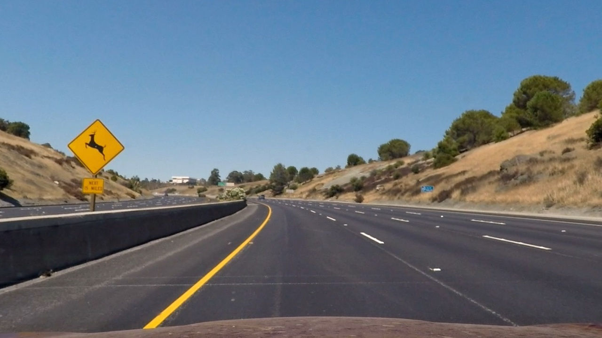
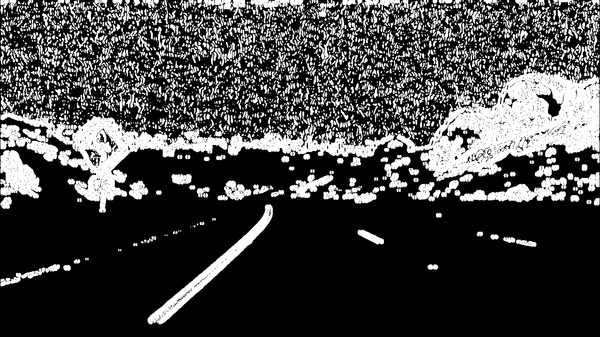
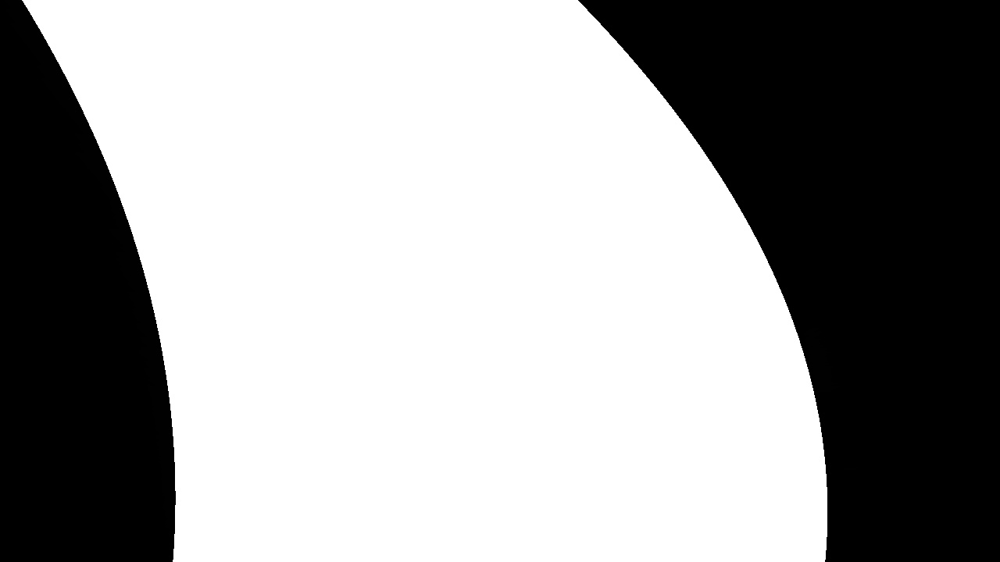
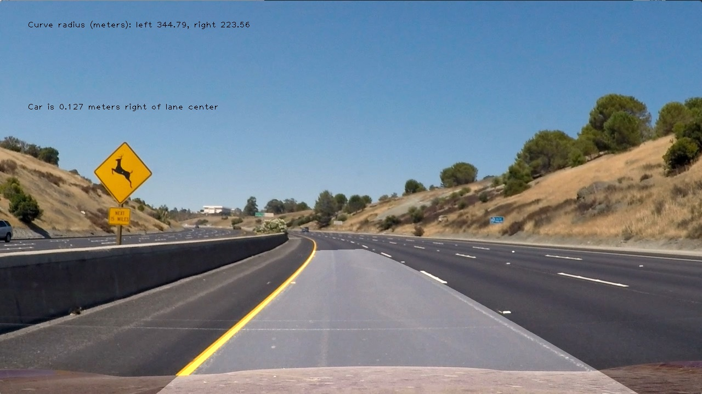

# Self-Driving Car Engineer Nanodegree


## Project: **Finding Lane Lines on the Road using Advanced Techniques** 
### **Adam Tetelman**
***
In this project I used used various image processing techniques to detect lanes on the road, ensure changes between images are reasonable, and display a final road image.

The project relies on the following packages:
- python3 (and standard libraries)
 - numpy (for array manipulation)
 - cv2 (for image processing - opencv2)  
 - matplotlib (for debugging/tuning and rendering images)
 - moviepy (for video rendering)
 - Jupyter/Ipython (for this notebook)


The tools taught included:
- Camera Calibration & Distortion
- Perspective Transofrm Techniques
- Convolutional Lane Detection
- Histogram Lane Detection
- Sobel Edge Detection Thresholds (x, y, magnitude, direction)
- Colorspace Conversion & Thresholding
- Lane Curvature Calculation

The resources used included:
- ./results (result images and videos)
- ./camera_cal (camera calibration images)
- ./test_img (test images)
- ./test_vid (test videos)

The code is structured into a `Line` class, a `LaneLines` class, and some test code. 


```python
from IPython.display import HTML
```

# Pipeline Summary
The main project pipeline takes a camera image and runs throught the below steps:

- Undistort
- Detect Edges
- Perspective Transform
- Detect Lanes
- Fill Lanes
- Undo Perspective Transform
- Calculate Curvature

# Camera Calibration

Before even beginning the pipeline it was necessary to calibrate for camera distortion.

This was done using 9x6 chessboards images taken from various angles and built in opencv2 functions to detect chessboard corners and calibrate for distortion.

The images used for calibration can be found in ./camera_cal. The calibration data is saved to ./results/calibration_data.p. The code used to generate the calibration is in the calibrate and calibrate_camera functions of the LaneLines class.


```python
HTML("""
<table>
<tr>
  <td><b>Original</b></td>
  <td><b>Detected Corners</b></td>
  <td><b>Undistorted</b></td>
</tr>
<tr>
  <td></td>
  <td></td>
  <td></td>
</tr>
```


<table>
<tr>
  <td><b>Original</b></td>
  <td><b>Detected Corners</b></td>
  <td><b>Undistorted</b></td>
</tr>
<tr>
  <td></td>
  <td></td>
  <td></td>
</tr>


# Undistort

This step uses the previously calculated camera calibration data to remove distortion from images. The code is located in `LaneLines.correct_distortion`.


```python
HTML("""
<table>
<tr>
<td><b>Original</b></td>
<td><b>Undistorted</b></td>
</tr>
<tr>
<td></td>
<td></td>
</tr>
</table>
""")
```


<table>
<tr>
<td><b>Original</b></td>
<td><b>Undistorted</b></td>
</tr>
<tr>
<td></td>
<td></td>
</tr>
</table>


# Detect Edges

The edge detection takes an undistorted image as input, runs through the below gradients, and returns the edge mask. The code is located in `LaneLines.edge_detection` and several `LaneLines.<type>_thresh` functions.

- Color threshold
  - Convert RGB to HLS
  - Saturation threshold
- Sobel Y gradient threshold
- Sobel X gradient threshold
- Location threshold
- And of all thresholds


```python
HTML("""
<br><table><b>Thresholding (seperate)</b>
<tr>
<td><b>Undistorted</b></td>
<td><b>Color Threshold</b></td>
<td><b>Y Gradient</b></td>
<td><b>X Gradient</b></td>
<td><b>Location Threshold</b></td>
<td><b>Edge Detection</b></td>
</tr>
<tr>
<td></td>
<td></td>
<td></td>
<td></td>
<td></td>
<td></td>
</tr>
</table>
""")
```


<br><table><b>Thresholding (seperate)</b>
<tr>
<td><b>Undistorted</b></td>
<td><b>Color Threshold</b></td>
<td><b>Y Gradient</b></td>
<td><b>X Gradient</b></td>
<td><b>Location Threshold</b></td>
<td><b>Edge Detection</b></td>
</tr>
<tr>
<td></td>
<td></td>
<td></td>
<td></td>
<td></td>
<td></td>
</tr>
</table>


# Perspective Transform

In order to transform a front facing image into a top-down image I had to tune the polygon values stored in `LaneLines.trans_src` and `LaneLines.trans_dst`. When a LaneLines is initialized the `LaneLines.setup_transform` function is called which calculates and save the transformation (`trans_M`) and reverse transformation matrix (`trans_M_rev`).

The `LaneLines.perspective_transform` takes an image and switches the viewpoint.


```python
HTML("""
<br><table>
<tr>
<td><b>Undistorted</b></td>
<td><b>Transformed (Edge image)</b></td>
<td><b>Transformed (Undistorted image)</b></td>
</tr>
<tr>
<td></td>
<td></td>
<td></td>
</tr>
</table>
""")
```


<br><table>
<tr>
<td><b>Undistorted</b></td>
<td><b>Transformed (Edge image)</b></td>
<td><b>Transformed (Undistorted image)</b></td>
</tr>
<tr>
<td></td>
<td></td>
<td></td>
</tr>
</table>


# Detect Lanes
I used a convolutional technique to identify lane lines. In my `LaneLines.find_lanes_conv` function I define a convolution size and the number of layers to break the image into. I then go (horizontal) layer by layer and run convolutions across each. I do this for the right and left half of the image. The result is a `level` centroids for the left and right lane. I then save these values to the left and right `Line`, call some class functions to calculate a line of best fit/save the points/etc. Future calls to the `find_lanes_conv` function will result in re-use of previously detected centroid points.


```python
HTML("""
<br><table>
<tr>
<td><b>Transformed (Edge image)</b></td>
<td><b>Lanes</b></td>
</tr>
<tr>
<td></td>
<td></td>
</tr>
</table>
""")
```


<br><table>
<tr>
<td><b>Transformed (Edge image)</b></td>
<td><b>Lanes</b></td>
</tr>
<tr>
<td></td>
<td></td>
</tr>
</table>


# Fill Lanes
After detecting the lanes we have a left and right line corresponding to them. In `LaneLines.fill_lanes` I use the fillPoly function to fill better display the lane.


```python
HTML("""
<br><table>
<tr>
<td><b>Transformed (Edge image)</b></td>
<td><b>Lanes</b></td>
</tr>
<tr>
<td></td>
<td></td>
</tr>
</table>
""")
```


<br><table>
<tr>
<td><b>Transformed (Edge image)</b></td>
<td><b>Lanes</b></td>
</tr>
<tr>
<td></td>
<td></td>
</tr>
</table>


# Undo Transform
In this step we simple run the image through the `perspective_transform` function with `rev=True`.


```python
HTML("""
<br><table>
<tr>
<td><b>Lanes Image</b></td>
<td><b>Un-Transformed</b></td>
</tr>
<tr>
<td></td>
<td></td>
</tr>
</table>
""")
```


<br><table>
<tr>
<td><b>Lanes Image</b></td>
<td><b>Un-Transformed</b></td>
</tr>
<tr>
<td></td>
<td></td>
</tr>
</table>


# Calculate Curvature & Detect Car

This functionality lives in the `LaneLines.calculate_curvature` and `Lines.update_curve` functions.

I convert the (x, y) coordinate points to reflect meters instead of pixels, use numpy to calculate the line of best fit polynomials, then use those polynomials to calculate the curve.

I calculate the position of the car in `LaneLines.calculate_car` using the bottommost position of the left/right lane.


```python
HTML("""
<br><table>
<tr>
<td><b>Final output</b></td>
</tr>
<tr>
<td></td>
</tr>
</table>
""")
```


<br><table>
<tr>
<td><b>Final output</b></td>
</tr>
<tr>
<td></td>
</tr>
</table>


# Video results


```python
HTML("""
<video width="960" height="540" controls>
  <source src="results/project_video_output.mp4">
</video>
""".format())
```


<video width="960" height="540" controls>
  <source src="files/results/project_video_output.mp4">
</video>


# Conclusion

The most difficult part of this project was adding robustness to the lane detection. I had some troubles with this at first. At first I was using a histogram to detect lane lines, however after switching to the convolutional method I saw much better results. In combination with some re-use of data and some sanity checks I was able to get this working. Overall, there was a lot of give-and-take between the pieces in the pipeline. Having a more open edge detection required different types of line detection than edge detection that was very particular. The solutions I came up with could be completely wrong for someone using a different edge detection system.

Possible problem areas:
- Videos of cars changing lanes
- Very dark roads
- Very curvy roads

Future Improvements:
- More complex outlier detection 
- More sanity checks between lines and past data
- Testing with additional video data
- Lane detection using multiple techniques

Final Thoughts:

Each step in this process was fairly simple. Edge detection, masking, curvature calculations, and lane detection. Put them all together and you have a fairly robust system to detect where the car and lanes are on the road. This program is able to accomplish a complex task in only 600 lines of code.
